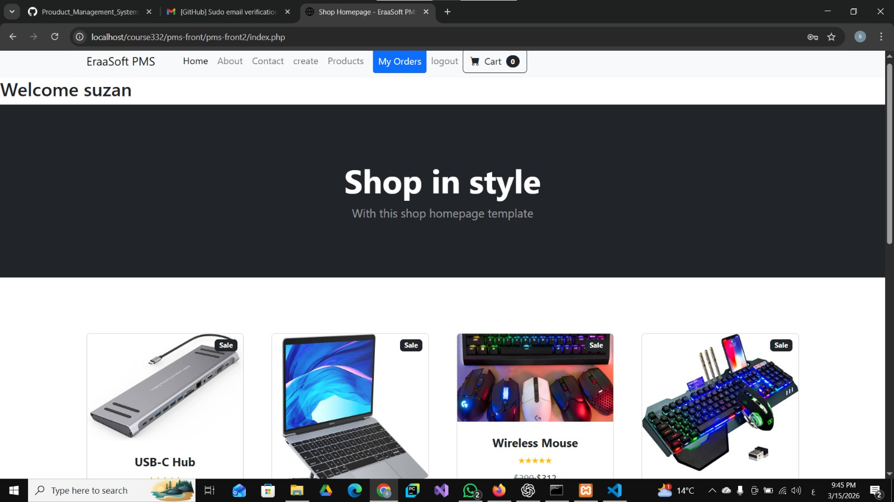
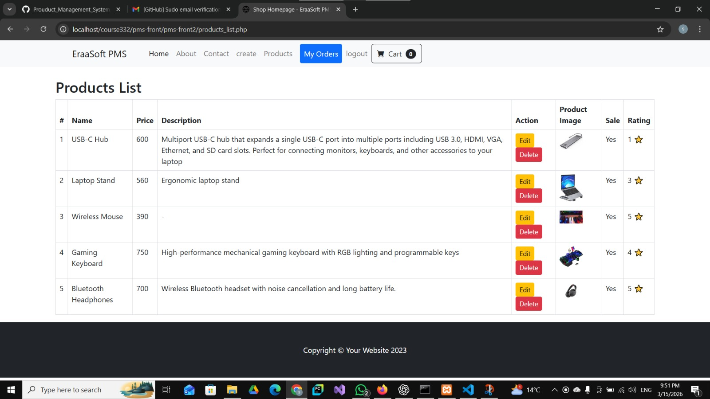
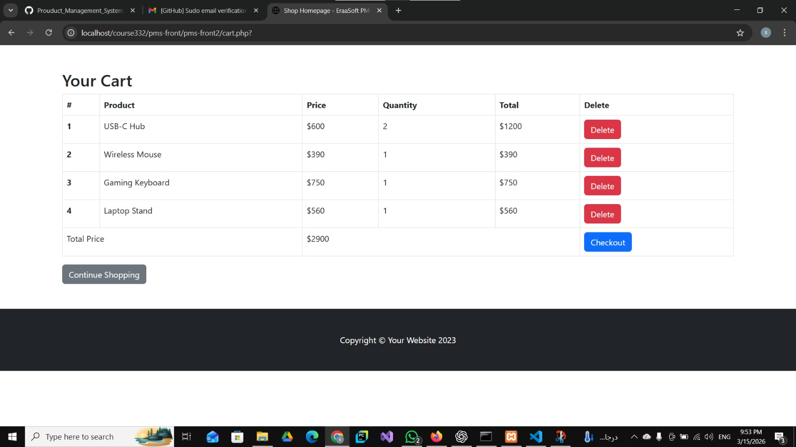

## Screenshots

### Home Page

### Products Page

### Cart Page

 

Project Description

Product Management System (PMS) is a simple web-based application that allows
users to manage products and place orders. The system enables users to browse
products, add them to a shopping cart, and create orders.
It also provides basic product management functionality.

The project is built using PHP for the backend and HTML, CSS, and Bootstrap
for the frontend. Instead of using a database, the system stores data in JSON files, 
which are read and updated dynamically.

Features

User login using PHP Sessions

Add and manage products

Display a list of available products

Add products to a shopping cart

Create orders from the cart

View orders created by the user

Delete orders if needed

Store and retrieve data using JSON files

Technologies Used

PHP HTML CSS Bootstrap

JSON

Session Management

Project Purpose

The main goal of this project is to practice the fundamentals of web development, including session handling, file-based data storage, and building a simple product and order management system
